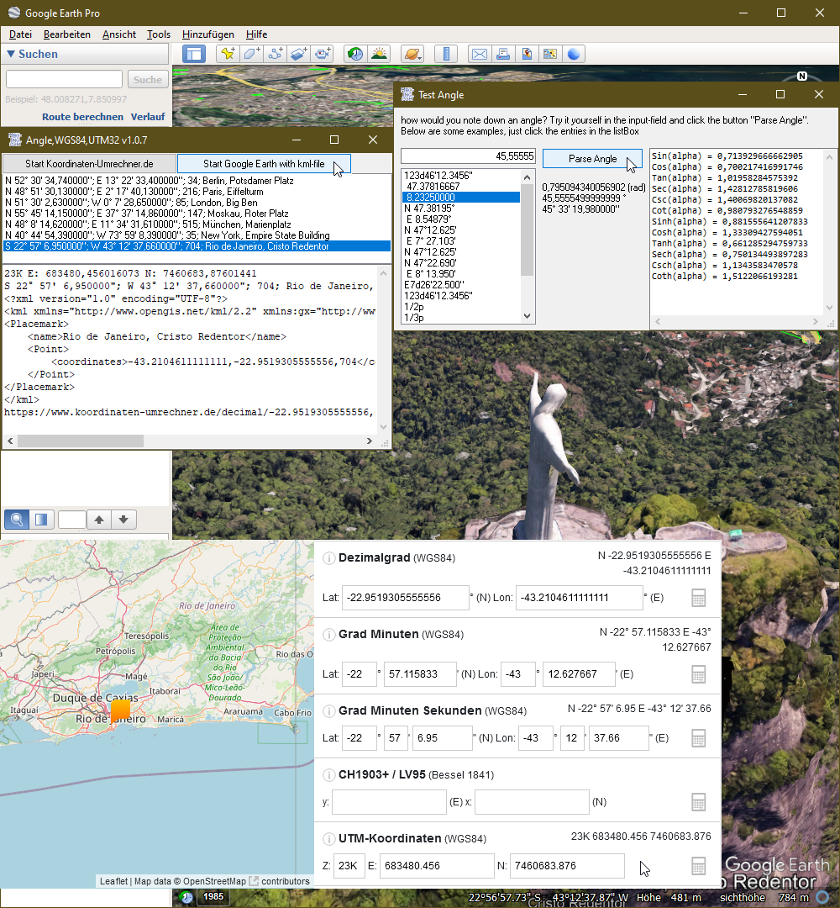

# Math_AngleWGS84UTM32
## Classes Angle, GeoPos & UTM32

 

Project started in march 2022.  
The Angle class parses an angle for different purposes e.g. in grad-minute-second view. Angle has all trigonometric functions.  
The GeoPos class is for gps geo-positioning-system purposes and uses the angle class for latitude and longitude.  
For showing the correct functionality the small test app sends a kml file to google earth or a link to Koordinaten-umrechner.de  
The GeoPos class calculates the distance between two or more geo-positions by using the Haversine-formula.   
For compatibility and authoritative purposes the UTM-class creates UTM32-coordinates from WGS84 coordinates and vice versa.   
You also have the possibility to view a track in google earth and show it's length calculated in google-earth.  
   

