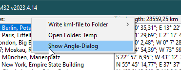
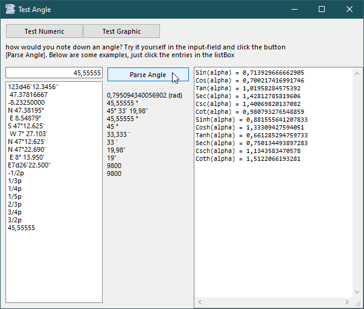
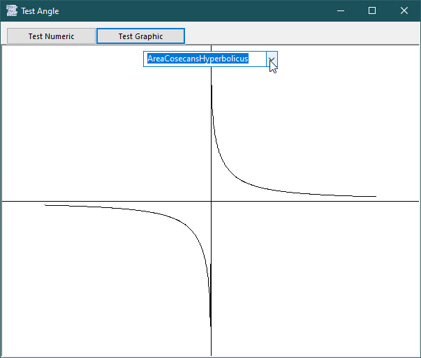
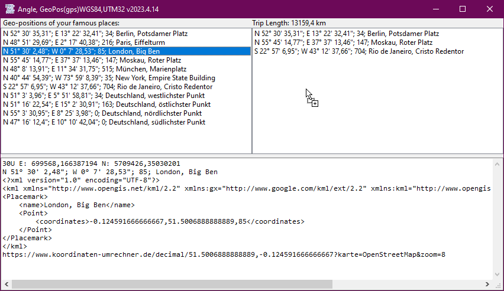
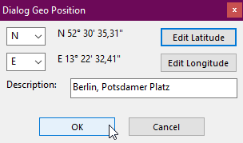
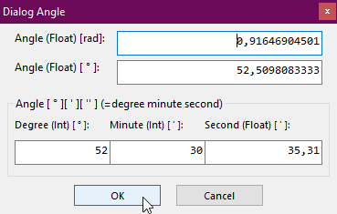
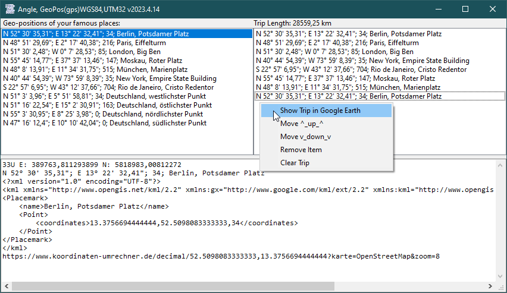
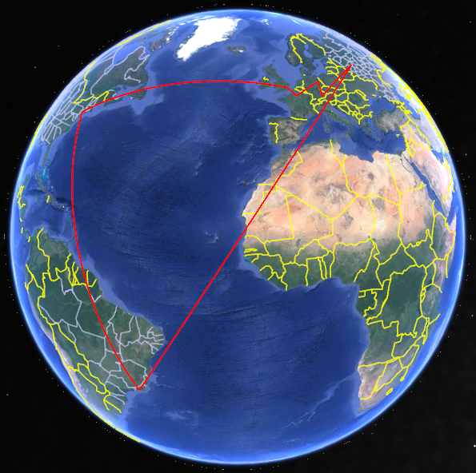
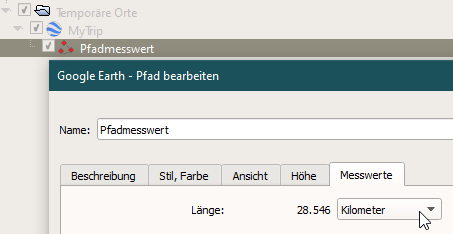

# Math_AngleWGS84UTM32
## Classes Angle, GeoPos & UTM32

 

Project started in march 2022.  
The Angle class stores an angle in radians internally, and can be used in all situations where you need an angle e.g. gps. 
With 5 different constructor-functions you can create an angle object with either a value in 
radians, degrees, gons, in 3 separate values for degree, minute, second or in a string. 
The Angle class has all trigonometric functions, you can view all functions graphically.  
The GeoPos class is for gps geo-positioning-system purposes and uses the angle class for the values of latitude and longitude.  
With the app you can send a kml file to google earth pro or a link to the website Koordinaten-umrechner.de 
The GeoPos class calculates the distances between two or more geo-positions by using the Haversine-formula. 
You may check the calculation by creating a Trip, send the trip to Google-Earth pro and look up the value. 
For compatibility and authoritative purposes the UTM-class creates UTM32-coordinates from WGS84 coordinates and vice versa.  
   

  
  
  

